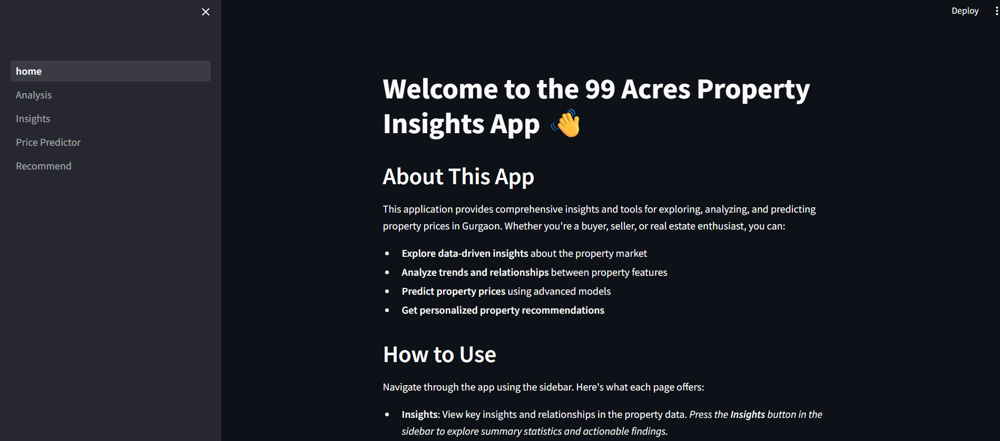
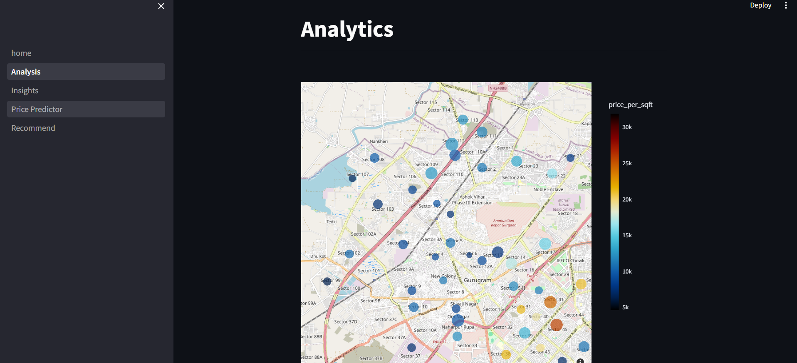
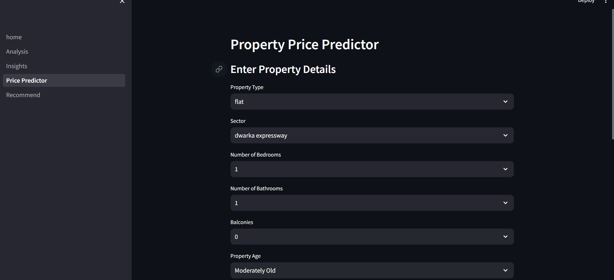
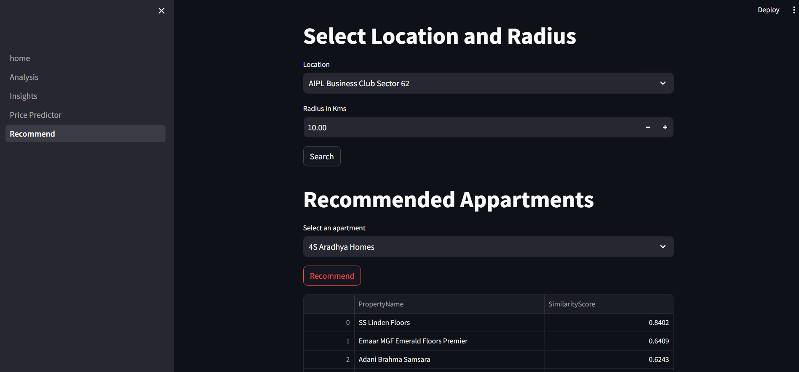

# 🏠 99 Acres Property Insights App


---

## ✨ Overview

Welcome to the **99 Acres Property Insights App**! This interactive web application empowers users to:
- 📊 **Explore** Gurgaon property data with actionable insights
- 🔍 **Analyze** trends, relationships, and sector-wise features
- 💸 **Predict** property prices using advanced models
- 🏡 **Get personalized recommendations** for properties

Whether you're a buyer, seller, investor, or real estate enthusiast, this app provides the tools and analytics you need to make informed decisions in the Gurgaon property market.

---

## 🚀 Features

- **Insights**: Key data relationships and summary statistics
- **Analysis**: Deep-dive analytics, sector comparisons, and word clouds
- **Price Predictor**: Estimate property prices based on features
- **Recommender**: Personalized property suggestions
- **Modern UI**: Built with Streamlit for a fast, interactive experience

---

## 🛠️ Tech Stack

-  **Python 3.9+**
-  **Streamlit**
-  **Pandas**
-  **NumPy**
-  **Plotly**
-  **Matplotlib**
-  **Seaborn**
-  **WordCloud**

---

## ⚡ Quick Start

1. **Clone the repository:**
   ```bash
   git clone <repo-url>
   cd 99_Acres_Predictor
   ```
2. **Install dependencies:**
   ```bash
   pip install -r requirements.txt
   ```
3. **Run the app:**
   ```bash
   streamlit run prediction_modules/home.py
   ```

---

## 📂 Project Structure

```
99_Acres_Predictor/
├── prediction_modules/
│   ├── home.py
│   └── pages/
│       ├── Insights.py
│       ├── Analysis.py
│       ├── Price_Predictor.py
│       └── Recommend.py
├── requirements.txt
├── README.md
└── ...
```

---

## 🖼️ Screenshots
## 🖼️ Screenshots

### 🏠 Home Page


### 📊 Insights Page


### 🔍 Analysis Page


### 💸 Price Predictor


### 🏡 Recommender


## 🙌 Contributing

Contributions, issues, and feature requests are welcome! Feel free to fork the repo and submit a pull request.

---

## 📧 Contact

For questions or feedback, reach out at: [your-email@example.com](mailto:your-email@example.com)

---

_Developed with ❤️ using Streamlit and open-source tools._ 